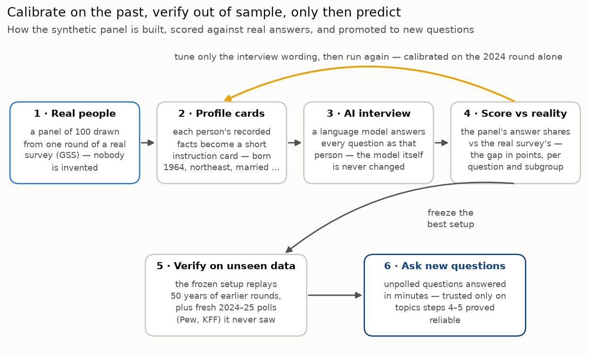

# Silicon-Sample

Silicon sampling is the practice of using AI models (mostly LLMs) to mimic human behaviour in surveys and studies.
**We ask an AI model to role-play one of 100 real Americans - each grounded in an actual respondent from a 50-year national survey - and put survey questions to them.** Before trusting a single prediction, the panel must first reproduce decades of answers real people already gave, subgroup by subgroup. Once we pass a reasonable accuracy threshold on a group/panel level we can check out-of-sample questions.

## Overview

The hardest test we could devise: put questions from real 2024–25 polls to the panel - questions that exist nowhere in the data it was calibrated on - and compare with what [Pew Research](https://www.pewresearch.org/) and [KFF](https://www.kff.org/) found:

- **Phone bans in schools ([Pew, July 2025](https://www.pewresearch.org/short-reads/2025/07/16/americans-support-for-school-cellphone-bans-has-ticked-up-since-last-year/)).** The panel said 73% support banning phones during class; Pew found 74%. When the question was changed to a stricter all-day ban, the panel's support dropped to 51% (Pew: 44%) - it tracked Pew's 30-point strictness gap with a 22-point drop of its own. The panel responds to what is asked, not just the topic.
- **AI and jobs ([Pew, April 2025](https://www.pewresearch.org/internet/2025/04/03/how-the-us-public-and-ai-experts-view-artificial-intelligence/)).** 63% of the panel expects fewer jobs; Pew found 64%.
- **Medicare covering weight-loss drugs ([KFF, May 2024](https://www.kff.org/health-costs/kff-health-tracking-poll-may-2024-the-publics-use-and-views-of-glp-1-drugs/)).** The miss: 88% in favor vs the real 61%. The part that matters: calibration had already flagged this exact bias - the model over-attributes generosity to Americans - before this poll was ever put to the panel.
- **And one question with no published answer.** Should zoning rules allow more apartment buildings in single-family neighborhoods? The panel returned 29% favor / 63% oppose, in minutes, for pennies. That is the product in miniature: a directional read on an unpolled question, with its reliability qualified by everything below.

Where calibration said "trust it," the fresh polls agreed. Where calibration flagged a bias, the fresh polls confirmed it. **A tool whose errors are predictable is a tool you know when to use.**

## How it works

The guiding constraint: **the AI model is never modified.** Only the "interview" around it - the persona description and the way questions are presented - is engineered. Every change is cheap, reversible, and readable as plain text.

1. **Build the panel from real people.** From the ~3,300 respondents of one survey round we draw a panel of 100 (a weighted draw, so the panel mirrors the US adult population the same way the survey does). Each drawn respondent becomes one simulated agent; we invent no personas. Panel size is a cost dial, not a data limit - the same draw scales to 1,000 or more.
2. **Write the interview script.** Each agent gets an instruction card: its person's facts plus strict rules - answer as this person would, choose exactly one offered option, reply in a fixed format. Questions are asked one at a time with no memory between questions, like the real interview.
3. **Score against reality.** The panel answers the same questions real respondents answered; the gap between the two answer distributions is measured in percentage points, per question and per demographic subgroup.
4. **Calibrate on one year only.** All tuning used the 2024 round alone. Two dials did the work: the persona format (a structured profile card beat a one-liner and a narrative biography) and the answer presentation - "escape-hatch" options like *depends* are handled the way real interviewers handle them, available but never read aloud. Together: average error 17.1 → 11.6 points.
5. **Verify on unseen history.** The tuned configuration was frozen and replayed against every survey round back to 1972 - period-appropriate panels answering that year's questions. None of that history was used during tuning.
6. **Confront fresh polls, then take new questions.** The panel answered the 2024–25 Pew and KFF questions above, and a small API now accepts questions nobody has polled yet.

### Meet one panelist

Every agent is a real, anonymous respondent row from the survey. This is agent #1 of the 2024 panel - respondent `gss:2024:2315` - exactly as the model receives it:

> You are answering survey questions as a specific American survey respondent, interviewed in 2024.
>
> Respondent profile:
> - Year of birth: 1964 (age 60)
> - Sex: male
> - Race: white
> - Region of the United States: northeast
> - Education: high school diploma
> - Work situation: working part time
> - Marital status: married
> - Number of children: 3
> - Religion: Protestant
> - Religious attendance: attends religious services every week
>
> Answer every question the way this person would, given their background and circumstances.

One question, as the interview presents it:

> Generally speaking, would you say that most people can be trusted or that you can't be too careful in dealing with people?
>
> Options:
> - Most people can be trusted
> - You can't be too careful in dealing with people
>
> Only if you absolutely cannot choose between the options above - as an extreme last resort - you may answer: "Depends".
>
> Respond with only JSON: {"answer": "<exact text of one option above>"}

The model answered `{"answer": "You can't be too careful in dealing with people"}` - the most common real answer in 2024. Across all 100 panelists, 66 chose "can't be too careful," almost exactly the real 65%. But the panel funneled most of the rest into "Depends" (32, vs 10% of real respondents) and almost nobody into "most people can be trusted" (2, vs 25%). One question, both faces of the tool: a near-perfect headline share with a specific, known bias underneath - which is why scoring happens per question and per subgroup, never just on averages.

### How to read the accuracy numbers

Every accuracy number in this document is the same simple thing: the average gap, in percentage points, between the panel's answer shares and the real survey's. If a real poll finds 60% "favor" and the panel says 65%, that is a 5-point gap; gaps are averaged over each question's options, then over all 26 questions. Some anchors:

| Average gap | What it means |
|---|---|
| 0 | perfect match with the real survey |
| ≈ 8 | typical result in published research on this task |
| **11.6** | **this panel, after calibration (17.1 before)** |
| ≈ 14.5 | a panel that picks answers at random |

Two things worth noticing. An uncalibrated setup really can be *worse than random guessing* - left alone, the model collapses different people into the same stereotyped answers. And a single average hides a lot: the calibrated panel lands within 1–4 points on several questions and 20+ points off on its worst topic, which is why the per-question chart below matters more than any one number.

## The evidence

**Calibration was systematic, not luck.** Three styles of persona card were compared on identical agents and questions - a *one-line persona*, a *narrative biography*, and a *structured profile card* (born 1964, male, northeast, high school…) - and then the calibrated answer presentation was added. Each step was measured; none touched the model:

**Accuracy transfers to years the tuning never saw.** The frozen 2024 configuration was replayed against all 34 earlier rounds back to 1972. Average error stayed inside a 12–18 point band, drifting up only a few points even five decades back:

**The panel reproduces group differences, not just national totals.** Asked whether government should reduce income differences, real respondents lean "yes" less and less as their own income rises. The panel - never told this pattern exists - shows the same slope at similar levels, and where it errs, it errs by *exaggerating* the real trend:

**We know where it is reliable and where it is not.** Several questions land within 1–4 points of the real survey - comparable to published research - while trust in people and institutions is systematically wrong:

**The result is not an artifact of one lucky model choice.** Five AI models answered with the same panel, questions, and instructions. A model ≈6× larger scored essentially the same; two well-regarded models did clearly worse; and the one model that "reasons" step-by-step spent ~16× more computation per answer and still lost. What separated the leaders appears to be how they were trained to converse - staying in character is nearly the job description here. Different models are also wrong about *different* topics, which is what makes model routing (see next steps) attractive:

## What we learned along the way

- *The model exaggerates real tendencies into stereotypes.* Group differences usually point the right way but are drawn too sharply. Real Americans over 65 rate their health about as well as everyone else (72% good-or-excellent vs 79% for under-30s); the simulated seniors turn visibly frail (43% vs 100%). Real financial satisfaction rises with income from 16% to 42%; the panel turns that gentle slope into a 0%-to-93% cliff. Direction: usually right. Confidence: too much.
- *Left to itself, the model hedges far more than people do.* Real interviewers never read "depends" aloud - they record it only if a respondent insists. Shown "depends" as a regular menu option, agents chose it more than five times as often as real people (91% vs 16% on one question). Presenting such options the way the real interview does cut roughly two points off the average error on top of the persona-format gains.
- *Some beliefs resist prompting altogether.* The model is convinced people are kinder than Americans report: asked whether most people would try to be fair or would take advantage, real respondents split almost evenly, while agents overwhelmingly choose "fair" under every wording we tried. Fixing that needs heavier tools - statistical post-correction, model routing, or fine-tuning - not better prompts.

## Questions a skeptic should ask

**Didn't the model just remember what people believed in 1985?**
For the historical rounds, partly yes - the model has read about history, so those tests measure *impersonation of a period*, not forecasting, and we label them that way. That is exactly why the headline test uses 2024–25 poll questions about GLP-1 drugs, AI, and school phone bans: topics that exist nowhere in the calibration data.

**Is 100 simulated people enough?**
It carries a few points of sampling noise (identical runs differ by ±1–2 points), so findings are read at the level of clear patterns, not single decimals. 100 is a cost dial: the same weighted draw scales to 1,000+.

**Why would anyone trust an AI's picture of public opinion?**
Nobody should trust it by default - that is the point of the design. Every claim the panel makes about the past is checkable against real recorded answers, per demographic subgroup, so trust is earned topic by topic. Where the panel earned it, fresh polls agreed within a point; where it didn't (interpersonal trust, generosity), we say so - and the one fresh-poll miss landed exactly there.

**Will this replace real polls?**
No. It is for the places a real poll can't reach in time or budget: piloting questionnaires, directional reads between polling waves, pre-testing how question wording shifts responses. Anything high-stakes still needs a field survey - ideally one this tool helped design.

## The data we check against

We calibrate and verify against the [General Social Survey](https://gss.norc.org/) (GSS), run by [NORC at the University of Chicago](https://www.norc.org/) since 1972 - one of the most widely used social-science datasets in existence. The file we use covers **35 survey rounds and 75,699 interviews**, each round sampling 3,000–4,000 people to represent the US adult population, with question wording kept stable across decades.

From each respondent we use their **background** (age, sex, race, region, education, income bracket, work situation, marital status, children, religion and attendance) as persona raw material, and their **opinions** - 26 long-running questions spanning contested social issues, government spending, trust, and self-assessment. Because real answer distributions exist for every question, every year, and every subgroup, each claim the panel makes can be checked against ground truth. Full question list, verbatim: [docs/GSS.md](docs/GSS.md).

## Where this sits in the research

- **Argyle et al. (2023), ["Out of One, Many"](https://www.cambridge.org/core/journals/political-analysis/article/out-of-one-many-using-language-models-to-simulate-human-samples/035D7C8A55B237942FB6DBAD7CAA4E49)** - introduced "silicon sampling" and "algorithmic fidelity"; the conceptual ancestor of this project.
- **Durmus et al. (2024, Anthropic), ["Global Opinions in Language Models"](https://arxiv.org/abs/2306.16388)** - LLM answers vs World Values Survey / Pew Global Attitudes.
- **Park et al. (2024, Stanford), ["Generative Agent Simulations of 1,000 People"](https://arxiv.org/abs/2411.10109)** - interview-transcript personas reach ~85% self-replication fidelity on GSS items.
- **Bisbee et al. (2024), ["The Perils of Large Language Models"](https://www.cambridge.org/core/journals/political-analysis/article/synthetic-replacements-for-human-survey-data-the-perils-of-large-language-models/B92267DC26195C7F36E63EA04A47D2FE)** - the key cautionary result (variance collapse); our calibration loop is designed to catch exactly this.
- **Kim & Lee (2024), ["AI-Augmented Surveys"](https://arxiv.org/abs/2305.09620)** - GSS retrodiction and unasked-question prediction; the closest methodological match.

Annotated bibliography with a dozen more sources: [references.md](references.md).

## Use cases

**Research & social science** - filling gaps in longitudinal data (what would a panel have said in a year it wasn't asked?); stress-testing hypotheses about opinion change before an expensive real fielding; cross-country work on slow-moving surveys like the [World Values Survey](https://www.worldvaluessurvey.org/).

**Policy & political** - pre-testing policy language across demographic subgroups before rollout; rapid "nowcasting" between official polling waves; message testing at a fraction of traditional cost and time.

**Commercial market research** - product and pricing sentiment ahead of a real consumer panel; ad-copy testing across segments; rapid pulse-checks for PR teams when waiting for a real poll isn't an option.

The common thread: silicon sampling is most defensible where a real historical baseline exists to calibrate against first. That is what separates it from "prompt a chatbot with a persona and hope" - the main critique leveled at this category. [Aaru](https://techcrunch.com/2025/12/05/ai-synthetic-research-startup-aaru-raised-a-series-a-at-a-1b-headline-valuation/)'s ~$1B valuation (Dec 2025, clients including McDonald's, Boston Beer, A24, Bayer) shows the commercial demand; what Aaru and comparable products don't publish is calibration methodology against public survey ground truth. That gap - academic-grade calibration rigor aimed at commercially valuable questions - is where Silicon-Sample sits.

## Next steps

Prompt engineering is the shallowest - and most transparent - way to steer a model, which is why we started there. Natural extensions, roughly in order of effort: larger panels (1,000+) and more questions · statistical post-correction of known per-topic biases (like pollsters' "house effect" corrections) · routing each question to the model best calibrated for it · richer personas built from each respondent's own recorded views · retrieval over real respondents' answer histories · and, last, fine-tuning on decades of real answers - the most powerful option and the hardest to audit.

## Run it yourself

The whole pipeline is a small Python CLI (`silicon`) plus a FastAPI service, DuckDB for storage, prompts as versioned Jinja2 text files, Docker-first. The full evidence base - 43 runs, ~101,000 model calls, ~30M tokens on ordinary open-weight cloud models - cost a few dollars of inference, and the replication guide has been executed end-to-end twice.

- [docs/REPLICATION.md](docs/REPLICATION.md) - reproduce every number and figure from scratch, exact commands
- [docs/CONCLUSIONS.md](docs/CONCLUSIONS.md) - the takeaways, distilled and numbered, with receipts
- [docs/GSS.md](docs/GSS.md) - the dataset and all 26 questions, verbatim
- [docs/README.md](docs/README.md) - map of all documentation, including internal design docs
