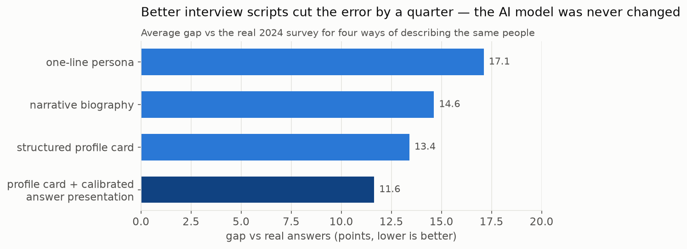
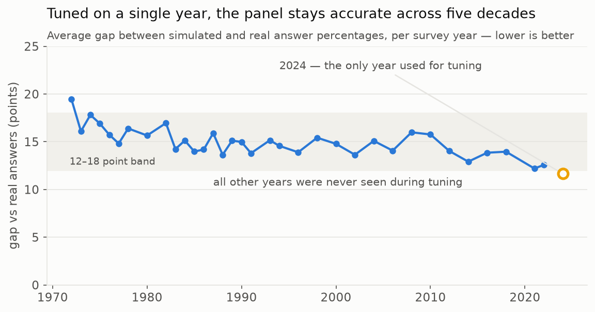
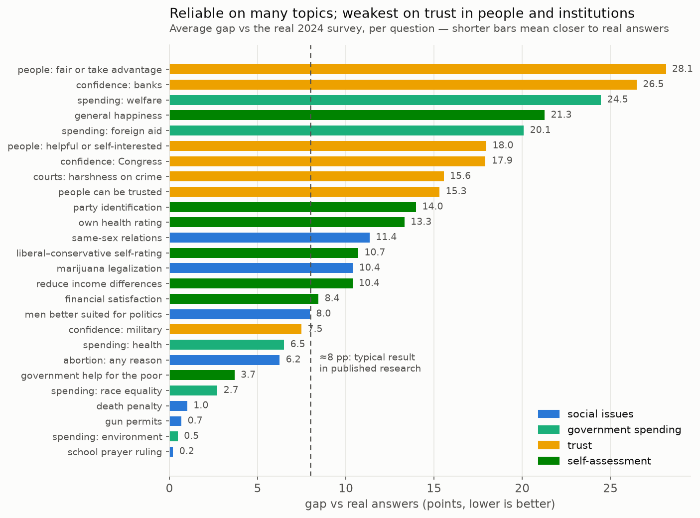
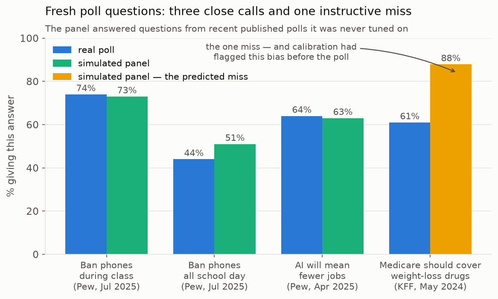
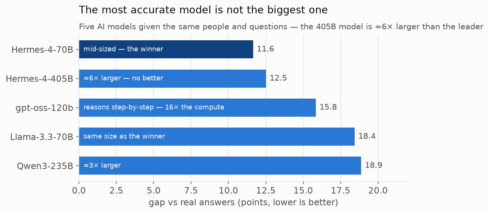
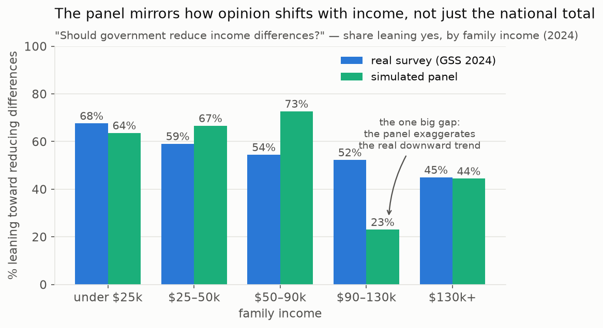

# Conclusions

Seven takeaways from calibrating a 100-agent synthetic GSS panel and testing it against five decades of survey history and fresh 2024–25 polls. Errors are mean absolute error in percentage points ("pp") between synthetic and weighted real answer distributions, averaged over 26 questions.

### 1. Prompt-only calibration is a real dial - 17.1 → 11.6pp without touching the model

No fine-tuning, no logit manipulation. Persona format plus answer presentation alone cut average error by roughly a third. A structured profile card ("born 1991, male, Northeast, bachelor's degree, …") beat both a one-line persona and a narrative biography of the same facts. Every step is a readable text diff, cheap to test and trivial to revert.

### 2. Demographics aren't the only dial - interview pragmatics matter as much

GSS interviewers never read "depends" aloud; they record it only if the respondent volunteers it. Shown "depends" as a regular menu option, agents chose it more than 5× too often (91% vs 16% on whether people try to be helpful). Rendering volunteered options the way the real interview presents them - available, never advertised - cut a further ~2pp after the persona-format gains. Matching the *measurement instrument*, not just the person, is where easy points are.

### 3. Calibration transfers out of sample - five decades inside a 12–18pp band

The configuration was tuned on the 2024 round only, frozen, then replayed against all 34 earlier rounds back to 1972 - period-appropriate panels answering that year's questions. Average error stayed at roughly 12–18pp throughout, drifting only a few points across 50 years. Caveat kept in view: the model has read about history, so this tests impersonation of a period, not forecasting.

### 4. Errors are structured by topic - which makes them predictable, which makes the tool usable

Several social-issue and spending questions land within 1–4pp of the real survey; trust in people and institutions is systematically wrong. That structure held out of sample: the panel's one big miss on fresh polls (Medicare covering weight-loss drugs, 88% vs KFF's 61%) sat exactly in the over-generosity bias family calibration had flagged beforehand, while the topics calibration trusted came in within a few points of Pew (73/74 and 51/44 on two phone-ban variants, tracking Pew's 30-point policy-strictness gap with a 22-point drop of its own). Predictable errors are the difference between an instrument and a random number generator.

### 5. Model size bought nothing; conversational training decided it

On identical panels and prompts, Hermes-4-405B scored essentially the same as Hermes-4-70B; Llama-3.3-70B and Qwen3-235B did clearly worse; and the step-by-step reasoning model (gpt-oss-120b) spent roughly 16× the completion tokens and still lost. Survey answers behave like fast in-character reactions, not reasoned conclusions - the winning model's character-training mattered more than parameter count.

### 6. Group differences reproduce - but amplified into stereotypes

Subgroup patterns usually point the right way at the wrong magnitude. The income gradient on redistribution reproduces at similar levels, but real seniors rate their health nearly as well as the young (72% vs 79% good-or-excellent) while simulated seniors collapse to 43% vs 100%. Direction: usually right. Confidence: too much - the variance-collapse failure mode reported by Bisbee et al. shows up here as overdrawn group contrasts, so subgroup reads need explicit tolerance bands.

### 7. Some priors don't yield to prompting at all

The model insists most people "would try to be fair"; real Americans split almost evenly, and no prompt wording we tried moved it. Beliefs baked in that deep need heavier machinery - per-topic statistical post-correction, routing questions to the model best calibrated for them, or fine-tuning on real answer histories - not more prompt words. Knowing where prompting stops working is itself a calibration result.

---

The full evidence base - 43 completed runs, ~101,000 LLM requests, ~30M tokens, mostly on a 70B-class model - was produced for a few dollars of inference, and has been reproduced from scratch once already. Exact commands to reproduce every number and figure: [REPLICATION.md](REPLICATION.md).
